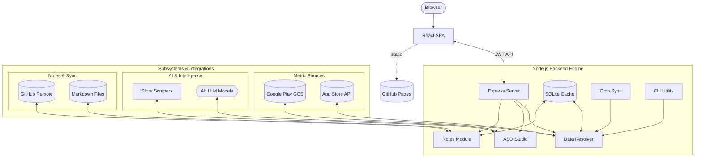

# AppRankly — Open-Source Mobile App Analytics & ASO Dashboard

> **Self-hosted iOS & Android analytics toolkit.** A private, unified alternative to App Store Connect and Google Play Console — keep 100% of your data and credentials on your own server.

<p align="center">
  <a href="https://zmsp.github.io/AppRankly/#demo"></a>
  <a href="https://github.com/zmsp/AppRankly/pkgs/container/apprankly"></a>
  <a href="https://ca.unraid.net/apps/apprankly-1bdjnw60t14ouy"></a>
  <a href="https://github.com/zmsp/AppRankly/releases"></a>
  <a href="https://github.com/zmsp/AppRankly/blob/main/LICENSE"></a>
  <a href="https://github.com/zmsp/AppRankly/stargazers"></a>
</p>

---

### Privacy-First Cross-Platform Analytics & Keyword Intelligence

Stop context-switching between App Store Connect and Google Play Console. **AppRankly** unifies your iOS and Android app performance into a single, sleek, self-hosted dashboard. Monitor **installs, uninstalls, active devices, retention cohorts, user survival curves, and release markers** side-by-side.

Features an **AI-Assisted ASO Studio** for zero-cost store autocomplete keyword discovery, keyword ranking checks, competitor comparisons, and metadata listing audits using your choice of OpenAI, Anthropic, or Gemini — with 100% of your analytics and API keys remaining securely on your server.

**[▶ Try the Live Interactive Demo](https://zmsp.github.io/AppRankly/#demo)** — no installation required, pre-loaded with sample data.

---

## 📖 Table of Contents
* [Screenshots](#screenshots)
* [Quick Start](#quick-start)
* [Key Features](#key-features)
* [Authentication & Credentials Setup](#authentication--credentials-setup)
* [Configuration Reference](#configuration-reference)
* [Headless CLI Utility](#headless-cli-utility)
* [Architecture & Tech Stack](#architecture--tech-stack)
* [Troubleshooting & FAQ](#troubleshooting--faq)
* [Contributing & Support](#contributing)

---

## Screenshots


<details>
<summary>**📷 Click to view individual full-resolution screenshots**</summary>

### Unified Analytics Dashboard
Installs, uninstalls, active devices, and country breakdowns across Google Play & Apple App Store in one glassmorphic interface.


### Detailed App Metrics
Per-app drill-down: version performance, daily trends, retention, and country-level distribution.


### Retention & User Survival Analytics
Cohort retention heatmaps, active retention proxies, survival curves, stickiness index, and churn risk intelligence.


### AI-Powered ASO Studio
Mine store autocomplete for zero-cost keyword discovery, check keyword ranks, audit listing health, and generate metadata variants with your choice of AI provider (OpenAI, Anthropic, or Gemini).


### Reports & Data Exports
Export overview stats, daily trends, dimension breakdowns, or full raw data archive bundles for offline analysis.


### Configuration Editor
Form editor, raw JSON manager, test connection tools, and built-in setup guide for credentials and data sources.


### Metrics Glossary & Formulas
Authoritative mathematical formulas, interpretation guides, platform origins, and data lag disclosures used to compute metrics.


</details>

---

## Quick Start

Pick your preferred deployment method. Note where `config.json` lives for each ecosystem:

| Deployment Method | Directory for `config.json` | Default Dashboard URL |
| :--- | :--- | :--- |
| **Docker Compose** | `./config/` | `http://localhost:3000` |
| **Pre-built Image (`docker run`)** | `./data/config/` | `http://localhost:3000` |
| **Unraid** | `/mnt/user/appdata/AppRankly/config/` | `http://[SERVER-IP]:3020` |
| **Docker Compose (Source Build)** | `./config/` | `http://localhost:3000` |
| **Local Node.js Development** | `./data/config/` | `http://localhost:3000` |

> [!IMPORTANT]
> **Prerequisite:** AppRankly fetches data directly from official store APIs (Google Cloud Storage reports and Apple App Store Connect API) to ensure complete privacy. Before launching, configure your access keys following the [Credentials Setup](#authentication--credentials-setup) guide.

### Option 1: Docker Compose (Recommended)

```bash
# 1. Clone the repository
git clone https://github.com/zmsp/AppRankly.git
cd AppRankly

# 2. Setup config files (mounts ./config into the container)
mkdir -p config/keys
cp example.config.json config/config.json
# Edit config/config.json and place API key files (.json for Google, .p8 for Apple) in config/keys/

# 3. Launch the container stack
docker compose up -d
```

Access the dashboard at **http://localhost:3000**.

### Option 2: Pre-built Docker Image

```bash
# 1. Pull the container
docker pull ghcr.io/zmsp/apprankly:main

# 2. Prepare data directory mappings
mkdir -p data/config/keys
cp example.config.json data/config/config.json
# Edit data/config/config.json and place API keys in data/config/keys/

# 3. Spin up the container
docker run -d \
  --name AppRankly \
  -p 3000:3000 \
  -v $(pwd)/data:/app/data \
  -e JWT_SECRET="your-secure-random-secret" \
  ghcr.io/zmsp/apprankly:main
```

### Option 3: Unraid

AppRankly is available natively via [Unraid Community Applications](https://ca.unraid.net/apps/apprankly-1bdjnw60t14ouy).

1. Search for **AppRankly** in your Unraid **Apps** tab and click Install.
2. *Alternative Manual Setup:* Download the XML template directly:
```bash
curl -o /boot/config/plugins/dockerMan/templates-user/apprankly.xml https://raw.githubusercontent.com/zmsp/AppRankly/main/unraid/apprankly.xml
```

3. Set appropriate permissions for the mapped directory: `chown -R 1000:1000 /mnt/user/appdata/AppRankly/`
4. Access via `http://[YOUR-SERVER-IP]:3020`.

*(See the detailed [unraid/README.md](unraid/README.md) for deeper customization options).*

### Option 4: Local Node.js Development

Requires Node.js 20+ (**Node 22.5+ highly recommended** — the SQLite caching layer relies on native `node:sqlite` features and safely degrades on older versions).

```bash
git clone https://github.com/zmsp/AppRankly.git
cd AppRankly

# Setup local workspace configuration
mkdir -p data/config/keys
cp example.config.json data/config/config.json

# Install workspace & UI dependencies, then launch development hot-reload
cd app && npm install
npm --prefix frontend install
npm run dev
```

---

## Key Features

* 🎯 **Unified Cross-Platform Core**: Access installs, uninstalls, active devices, software upgrades, and country/device breakdowns across Google and Apple under one cohesive UI.
* 🤖 **AI-Powered ASO Studio**: Autocomplete keyword mining, keyword rank checks, competitor parsing, metadata health checks, and review sentiment synthesis. Use **OpenAI, Anthropic, or Gemini** natively.
* ⚡ **Zero-Dependency SQLite Cache**: Store historical metrics, aggregates, and expensive AI results safely inside `node:sqlite` so you never pay double API bills or redundant fetch times.
* 📝 **Contextual Notebooks**: Save persistent notes per application to mark feature additions or marketing campaigns directly inline with data trends.
* 🔔 **Background Scheduler & Push Notifications**: Automated cron sync cycles that broadcast performance thresholds to your phone using [ntfy.sh](https://ntfy.sh/) (free, privacy-preserving, and optional).
* 🚀 **Release Tracking**: Tag specific application releases or let the app auto-detect updates to trace impact visually across data timelines.
* 🛠 **Headless CLI Companion**: Pull data payloads, migrate states, or perform manual historical database backfills over custom chron ranges using a scriptable terminal tool.

---

## Authentication & Credentials Setup

### 1. Google Play (via GCS reports)

Google Play exports structured performance metrics into a private Google Cloud Storage bucket daily. AppRankly authenticates against this bucket securely.

1. **Generate a GCP Service Account Key**:
* Visit the [Google Cloud IAM Console](https://console.cloud.google.com/iam-admin/serviceaccounts) and create a service account (e.g., `playstore-stats-reader`).
* Navigate to **Keys** → **Add Key** → **Create New Key (JSON)**. Save this file to your mapped volume as `keys/google_key.json`.

2. **Assign Play Console Access**:
* Navigate to the [Google Play Console](https://play.google.com/apps/publish) → **Users and Permissions** and invite the newly created service account email.
* Assign the **"View app information and download bulk reports (read-only)"** permissions.
* *Note: Permissions across GCS can sometimes take up to 24 hours to replicate completely.*

3. **Capture Your Bucket Endpoint**:
* In the Play Console, head to **Download reports** → **Statistics** and select **Copy Cloud Storage URI** (e.g., `gs://pubsite_prod_12345678/stats/installs/`).
* Your target bucket name is the unique string value located between `gs://` and the subsequent forward slash.

### 2. Apple App Store Connect (via API)

1. Navigate to [App Store Connect](https://appstoreconnect.apple.com/) → **Users and Access** → **Integrations (Keys)**.
2. Generate an API Key with the **Sales and Reports** access role.
3. Download the provided `.p8` credential token into your designated `keys/` directory mapping.
4. Record the **Issuer ID** listed at the top of the interface and the specific 10-character **Key ID**.

### 3. GitHub (for Notes Sync)

AppRankly can sync your application notes and marketing records to a private GitHub repository, ensuring your annotations are versioned and backed up.

1. **Create a Repository**: Create a private repository on GitHub (e.g., `my-app-notes`).
2. **Generate a Personal Access Token**:
   * Visit [GitHub Token Settings](https://github.com/settings/tokens).
   * Click **Generate new token (classic)**.
   * Scope: Select **'repo'** (Full control of private repositories).
   * Copy the generated token (this will be used as your `password` in the config).
3. **Configure in AppRankly**: Add the `gitNotes` block to your `config.json` as shown in the [Configuration Reference](#configuration-reference).

---

## Configuration Reference

Duplicate `example.config.json` inside your designated configuration target directory and adjust the payload schema values:

```json
{
  "name": "Production Apps",
  "projectID": "your-gcp-project-id",
  "bucketName": "pubsite_prod_12345678",
  "keyFilePath": "keys/google_key.json",
  "appleIssuerId": "xxxx-xxxx-xxxx-xxxx",
  "appleKeyId": "XXXXXXXXXX",
  "appleVendorId": "85000000",
  "keyFilePath_apple": "keys/apple_key.p8",
  "PlaystoreConsoleUrl": "https://play.google.com/console/u/0/developers/123456",
  "ntfyTopic": "",
  "refreshIntervalHours": 1,
  "statsCheckRangeDays": 30,
  "activeStartHour": 9,
  "activeEndHour": 20,
  "appMetadata": {
    "com.example.app": { "consoleAppId": "123456" }
  },
  "ignoredPackages": ["com.example.testapp"],
  "ai": {
    "defaultProvider": "openai",
    "providers": {
      "openai":    { "apiKey": "sk-...", "model": "gpt-4.5-preview" },
      "anthropic": { "apiKey": "sk-ant-...", "model": "claude-3-5-sonnet" },
      "gemini":    { "apiKey": "...", "model": "gemini-1.5-flash" }
    }
  },
  "gitNotes": {
    "remoteUrl": "https://github.com/youruser/your-notes-repo.git",
    "username": "your-github-username",
    "password": "your-personal-access-token",
    "branch": "main"
  }
}
```

### Configuration Fields

| Field | Context Ecosystem | Purpose and Definition | Mandate |
| --- | --- | --- | --- |
| `name` | Core Environment | Human-readable identity tag for the accounts dashboard. | Required |
| `projectID` | Google Play | The target identifier matching your Google Cloud Console project. | Optional |
| `bucketName` | Google Play | Extracted Cloud Storage ID value containing metric exports. | Optional |
| `keyFilePath` | Google Play | Relative directory reference parsing your Google IAM `.json` token file. | Optional |
| `appleIssuerId` | App Store Connect | Universal API UUID extracted from your Connect keys management area. | Optional |
| `appleKeyId` | App Store Connect | Explicit 10-character reference code matching your downloaded key token. | Optional |
| `keyFilePath_apple` | App Store Connect | Relative directory reference parsing the generated `.p8` access key. | Optional |
| `ntfyTopic` | Alert Framework | Unique secret path defining your subscription string. Leave empty `""` to turn off. | Optional |
| `refreshIntervalHours` | Worker Lifecycle | Defines the lookup intervals checking for fresh metrics upstream. | Default: `1` |
| `statsCheckRangeDays` | Data Aggregation | Window depth processing past timeline metrics during cron sync updates. | Default: `30` |
| `gitNotes` | Version Control | Configuration for syncing local notes to a remote Git repository (GitHub/GitLab). | Optional |
| `ai` | Optimization Lab | Object mappings storing keys and customized models across AI vendors. | Optional |

---

## Headless CLI Utility

Run maintenance operations, sync metrics, or handle migrations cleanly via the integrated command interface:

```bash
# Sync + verify configuration against index position zero
node app/cli.js -s 0

# Target historical sync tasks by custom environment name
node app/cli.js -s "Production Apps"

# Fully decoupled ingestion parameters bypassing file configurations
node app/cli.js \
  --key="data/config/keys/google_key.json" \
  --projectID="your-gcp-project-id" \
  --bucketName="pubsite_prod_12345678" \
  --packageName="com.example.app"
```

### Internal Engine Maintenance Targets

Execute these utilities directly from inside the localized `/app` path workspace:

```bash
npm run db:migrate    # Force target and process outstanding schema changes
npm run db:backfill   # Pull file archives historically (e.g., cli.js backfill --since YYYY-MM)
npm run db:status     # Output active table indices, row weight, and localized scope coverage
npm run cache:clear   # Drop cached timeline states to force total downstream cache regeneration
```

---

## Architecture & Tech Stack

* **Backend Application Core**: Node.js 20+ alongside Express. Secured with JWT tokens. Employs zero-native dependency performance pipelines like `node:sqlite`, raw UTF-16 streaming buffers using Fast-CSV, and native cryptographic integrations signing asymmetric ES256 tokens for Apple integrations.
* **User Interface Engineering**: React 18 powered alongside Vite. Implements fully dynamic visual charting using `react-chartjs-2` running over an adaptive Tailwind CSS engine optimized for fluid dark environments.
* **Scraping, Optimization & LLM Adapters**: Integrates multi-channel store hooks parsing active listings data concurrently while standardizing multi-tenant inference models cleanly across the native SDK layers of OpenAI, Anthropic, and Google Gemini.

### Flow Architecture



---

## Troubleshooting & FAQ

---

## Contributing

We love contributions! Review our detailed [CONTRIBUTING.md](CONTRIBUTING.md) to learn how to prepare local tracking environments, map diagnostic test workflows, and open up performance patches inside our pipelines cleanly.

For security concerns, vulnerabilities, and disclosures, please see our [Security Policy](SECURITY.md).

---

## ☕ Support & Ecosystem

Discover additional utilities and self-hosted tools on my homepage at **[apps.shahadat.us](https://apps.shahadat.us/)** or support ongoing open-source maintenance here:

---

## License

AppRankly is distributed as open-source software protected under the terms of the **[GNU Affero General Public License v3.0 (AGPL-3.0)](LICENSE)**.
