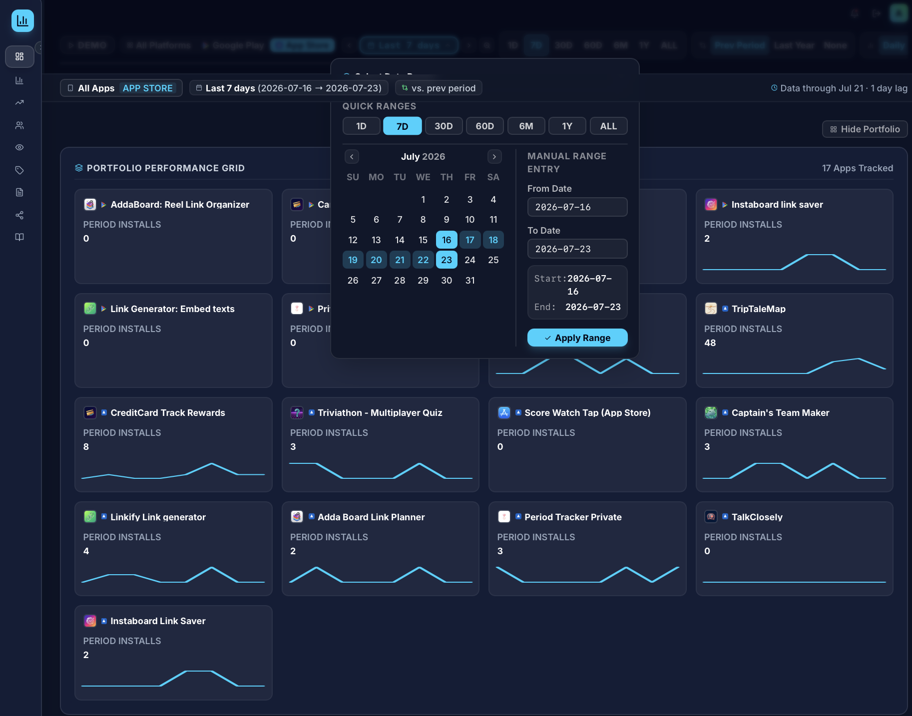
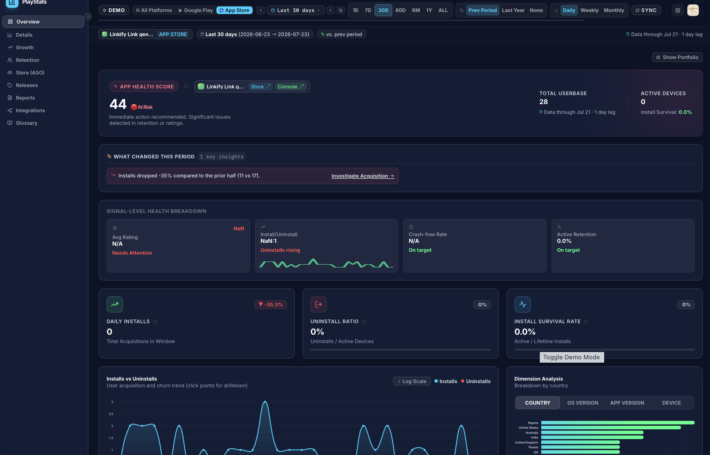
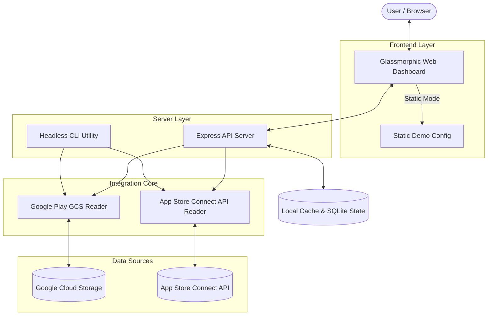

# AppRankly — Mobile App Store Analytics Dashboard

[](LICENSE)
[](https://github.com/zmsp/AppRankly/pkgs/container/apprankly)
[](package.json)
[](unraid/README.md)
[](CONTRIBUTING.md)

A self-hosted, open-source analytics pipeline and glassmorphic web dashboard for aggregating, visualizing, and tracking mobile app performance across the **Google Play Store** (via Google Cloud Storage reports) and the **Apple App Store** (via App Store Connect API).

Includes a single-page analytics web application, a headless CLI for automated cron jobs/scripting, and full Docker & Unraid container support.





---

## ⚡ Quick Start

Most users deploy this application using **Docker** or **Unraid**. Pick your preferred deployment method below.

### 🌐 Live Interactive Demo
Try the dashboard instantly without installing anything:  
👉 **[Explore the Live Interactive Demo](https://www.zobairshahadat.com/appstore-analytics/)** *(Running in simulated demo mode with sample data)*

---

### Option 1: Docker Compose (Recommended)

1. **Clone the repository:**
   ```bash
   git clone https://github.com/zmsp/AppRankly.git
   cd AppRankly
   ```

2. **Create configuration folder & files:**
   ```bash
   mkdir -p data/config/keys
   ```
   Place your `config.json` inside `data/config/` and your API credentials (`.json` for Google, `.p8` for Apple) inside `data/config/keys/`.

3. **Start the application:**
   ```bash
   docker-compose up -d
   ```

4. Access the dashboard at **`http://localhost:3000`**.

---

### Option 2: Pre-Built Docker Image (Standalone)

Run directly using the official GitHub Container Registry image:

```bash
# 1. Pull the latest image
docker pull ghcr.io/zmsp/apprankly:latest

# 2. Create local data directory
mkdir -p $(pwd)/data/config/keys

# 3. Launch container
docker run -d \
  --name AppRankly \
  -p 3000:3000 \
  -v $(pwd)/data:/app/data \
  -e JWT_SECRET="your-secure-random-secret" \
  ghcr.io/zmsp/apprankly:latest
```

---

### Option 3: Unraid Deployment

1. Open terminal on your Unraid server and run:
   ```bash
   curl -o /boot/config/plugins/dockerMan/templates-user/apprankly.xml https://raw.githubusercontent.com/zmsp/AppRankly/main/unraid/apprankly.xml
   ```
2. Navigate to Unraid **Docker** tab -> **Add Container** -> Select **AppRankly** template.
3. Configure path permissions (`chown -R 1000:1000 /mnt/user/appdata/AppRankly/`).
4. Access the Unraid UI at **`http://[YOUR-SERVER-IP]:3020`**.

For detailed Unraid instructions, see the [Unraid Guide](unraid/README.md).

---

### Option 4: Local Node.js Development

```bash
# 1. Clone & install dependencies
git clone https://github.com/zmsp/AppRankly.git
cd AppRankly
npm install

# 2. Start development server (backend + frontend watch mode)
npm run dev
```

---

## ✨ Key Features

- 📊 **Unified Cross-Platform Metrics**: Aggregate installs, uninstalls, active devices, and country/device breakdowns across Google Play and Apple App Store in one unified interface.
- 🕒 **Grafana-Style Date Selector**: Quick relative presets (Last 7 days, 30 days, 90 days, 1 year, Custom Range) with single-day drill-downs.
- 🎨 **Glassmorphic Dark Dashboard**: Interactive Chart.js graphs, platform filters, country distribution tables, and app version metrics.
- 🔒 **Privacy & Self-Hosted Security**: Keep your App Store credentials, Google Play Cloud Storage keys, and metric data 100% on your own server. JWT authentication protected.
- 💻 **Headless CLI Utility**: Command-line tool to pull metrics, backfill databases, or integrate into custom notification bots/cron jobs.
- 🐳 **Lightweight & Container Ready**: Multi-stage Alpine Docker image optimized for minimal footprint and low resource usage.

---

## 🔑 Authentication & Credentials Setup

To fetch live metrics from Google Play Console and Apple App Store Connect, follow the step-by-step setup below.

### 1. Google Play Console Setup (via GCS Reports)

Google Play Console exports daily CSV reports directly into a private Google Cloud Storage (GCS) bucket.

1. **Create GCP Service Account Key**:
   - Go to [Google Cloud IAM & Admin Console](https://console.cloud.google.com/iam-admin/serviceaccounts).
   - Create a service account (e.g. `playstore-stats-reader`).
   - Go to **Keys** -> **Add Key** -> **Create New Key (JSON)**.
   - Save file to `data/config/keys/google_key.json`.

2. **Grant Access in Play Console**:
   - Go to [Google Play Console](https://play.google.com/apps/publish) -> **Users and Permissions**.
   - Invite your service account email address.
   - Grant **"View app information and download bulk reports (read-only)"** permission.
   - *Note: GCS bucket permissions can take up to 24 hours to sync after invite.*

3. **Locate your GCS Bucket Name**:
   - In Google Play Console, go to **Download reports** -> **Statistics**.
   - Click **Copy Cloud Storage URI** (e.g., `gs://pubsite_prod_12345678/stats/installs/`).
   - Your bucket name is the string between `gs://` and the first slash: `pubsite_prod_12345678`.

---

### 2. Apple App Store Connect Setup (via API)

1. **Generate Sales & Reports API Key**:
   - Log into [App Store Connect](https://appstoreconnect.apple.com/) -> **Users and Access** -> **Integrations (Keys)**.
   - Click **Generate API Key** with **Sales and Reports** access role.
   - Download the `.p8` private key file and save it to `data/config/keys/apple_key.p8`.
2. **Note Identifiers**:
   - Copy your **Issuer ID** (UUID at the top of the Keys page).
   - Copy your **Key ID** (10-character code next to your key).

---

## ⚙️ Configuration Reference

The application reads app configurations from `data/config/config.json`. Below is a template example:

```json
[
  {
    "name": "Production Apps",
    "projectID": "your-gcp-project-id",
    "bucketName": "pubsite_prod_12345678",
    "keyFilePath": "keys/google_key.json",
    "appleIssuerId": "xxxx-xxxx-xxxx-xxxx",
    "appleKeyId": "XXXXXXXXXX",
    "keyFilePath_apple": "keys/apple_key.p8",
    "ignoredPackages": ["com.example.testapp"]
  }
]
```

### Configuration Fields

| Field | Platform | Description | Required |
|-------|----------|-------------|----------|
| `name` | Both | Display label for this configuration account | Yes |
| `projectID` | Google | Google Cloud Project ID | Yes (for Google Play) |
| `bucketName` | Google | GCS Bucket name from Play Console URI | Yes (for Google Play) |
| `keyFilePath` | Google | Path to service account JSON key relative to `config.json` | Yes (for Google Play) |
| `appleIssuerId` | Apple | App Store Connect Issuer ID | Yes (for Apple App Store) |
| `appleKeyId` | Apple | App Store Connect Key ID | Yes (for Apple App Store) |
| `keyFilePath_apple` | Apple | Path to `.p8` key file relative to `config.json` | Yes (for Apple App Store) |
| `ignoredPackages` | Both | Array of package names or bundle IDs to exclude from dashboard | Optional |

### Environment Variables

| Variable | Default | Description |
|----------|---------|-------------|
| `PORT` | `3000` | HTTP port for the web dashboard server |
| `JWT_SECRET` | `change-me...` | Secret key used for admin authentication tokens |
| `CONFIG_PATH` | `/app/data/config/config.json` | Path to global JSON configuration file |
| `DATA_DIR` | `/app/data` | Path to persistent app storage (database cache & system state) |

---

## 💻 Headless CLI Utility

Query app statistics, trigger data syncs, or run headless reporting directly from your terminal:

```bash
# Query metrics for the first configured project (index 0)
node app/cli.js -s 0

# Query metrics by project name
node app/cli.js -s "Production Apps"

# Custom query with explicit parameters
node app/cli.js \
  --key="data/config/keys/google_key.json" \
  --projectID="your-gcp-project-id" \
  --bucketName="pubsite_prod_12345678" \
  --packageName="com.example.app"
```

### CLI Command Options

| Argument | Short | Description |
|----------|-------|-------------|
| `--project` | `-s` | Name or zero-based index of project in `config.json` |
| `--config` | `-c` | Path to `config.json` file (default: `../config/config.json`) |
| `--key` | `-k` | Path to Google Service Account JSON key |
| `--projectID` | `-g` | Google Cloud Project ID |
| `--bucketName` | `-b` | Google Play Console GCS Bucket name |
| `--packageName` | `-p` | Specific app package identifier |

---

## 🏗️ Architecture & Tech Stack

### Tech Stack
- **Backend**: Node.js (v20+), Express.js, JWT Authentication, Fast-CSV, Google Cloud Storage SDK, JWT/ES256 Apple Signer.
- **Frontend**: HTML5, Vanilla JavaScript, Chart.js visualization library, CSS3 (Glassmorphism design system).
- **Containerization**: Multi-stage Docker Alpine build, Unraid XML Docker Template.

### System Architecture Diagram



---

## ❓ Troubleshooting & FAQ

<details>
<summary><b>1. Why does Google Play show 0 stats or permission denied errors?</b></summary>
Google Play GCS bucket permissions can take up to 24 hours to propagate after you invite the service account email in Google Play Console. Double check that the service account has "View app information and download bulk reports (read-only)" permission.
</details>

<details>
<summary><b>2. How do permissions work when deploying on Unraid / Docker?</b></summary>
The Docker container runs as non-root UID 1000 (`node`). Ensure your host data folder permissions are owned by user 1000:
<code>chown -R 1000:1000 /path/to/data</code>
</details>

<details>
<summary><b>3. Can I run without live credentials for evaluation?</b></summary>
Yes! Toggle the **Demo Mode** switch in the web UI sidebar to explore the full dashboard with realistic simulated app data.
</details>

---

## 🤝 Contributing

Contributions are welcome! Please feel free to submit a Pull Request or open an issue for feature requests and bug reports.

1. Fork the repository (`https://github.com/zmsp/AppRankly/fork`)
2. Create your feature branch (`git checkout -b feature/amazing-feature`)
3. Commit your changes (`git commit -m 'Add amazing feature'`)
4. Push to the branch (`git push origin feature/amazing-feature`)
5. Open a Pull Request

---

## 📄 License

This project is open-source and licensed under the **[MIT License](LICENSE)**.
