<p align="center">
  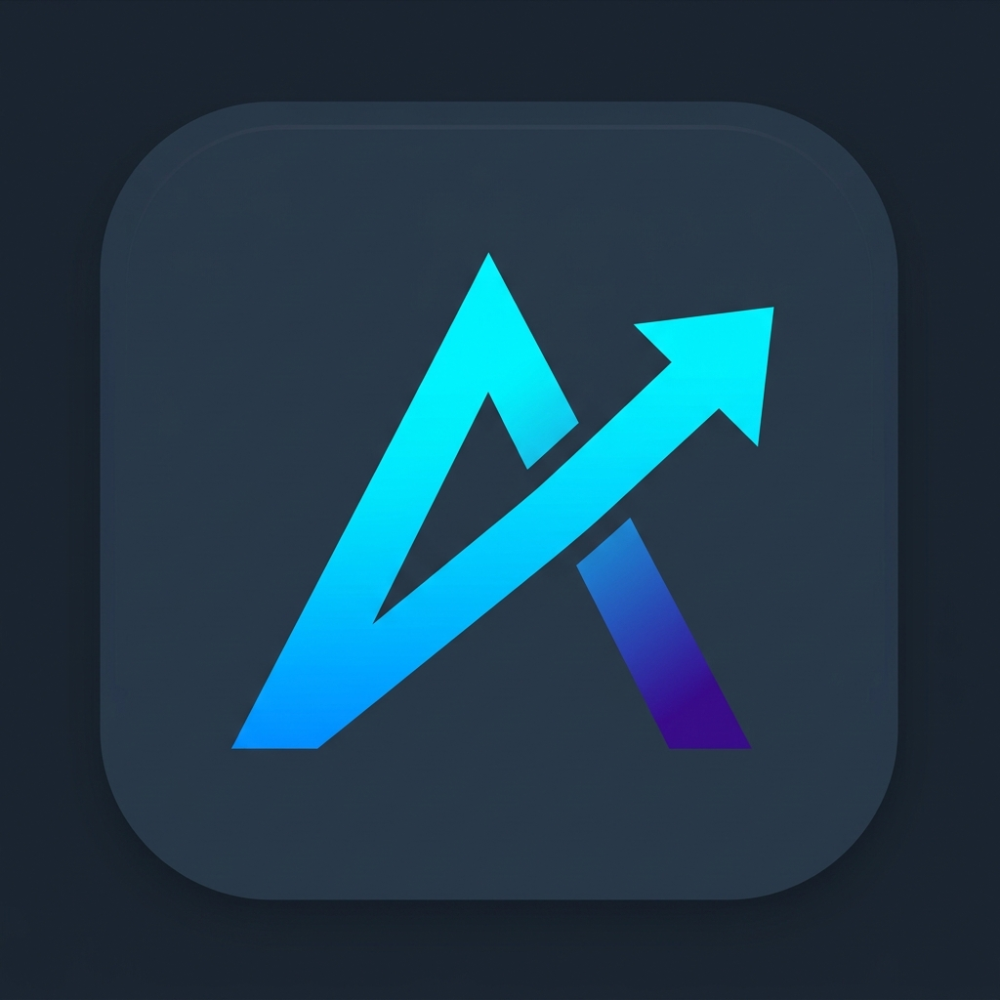
</p>

# AppRankly — Open-Source Mobile App Analytics & ASO Dashboard

> **Self-hosted iOS & Android analytics toolkit.** A private, unified alternative to App Store Connect and Google Play Console — keep 100% of your data and credentials on your own server.

[](https://zmsp.github.io/AppRankly/#demo)
[](https://github.com/zmsp/AppRankly/pkgs/container/apprankly)
[](https://ca.unraid.net/apps/apprankly-1bdjnw60t14ouy)
[](https://github.com/zmsp/AppRankly/releases)
[](https://github.com/zmsp/AppRankly/blob/main/LICENSE)
[](https://github.com/zmsp/AppRankly/stargazers)

---

### Privacy-First Cross-Platform Analytics & Keyword Intelligence

Stop context-switching between App Store Connect and Google Play Console. **AppRankly** unifies your iOS and Android app performance into a single self-hosted dashboard. Monitor **installs, uninstalls, active devices, retention cohorts, user survival curves, and release markers** side-by-side.

Features an **AI-Assisted ASO Studio** for zero-cost store autocomplete keyword discovery, keyword ranking checks, competitor comparisons, and metadata listing audits using your choice of OpenAI, Anthropic, or Gemini — with 100% of your analytics and API keys remaining on your server.

**[▶ Try the Live Interactive Demo](https://zmsp.github.io/AppRankly/#demo)** — no install needed, runs on sample data.

**Contents:** [Screenshots](#screenshots) · [Quick Start](#quick-start) · [Features](#key-features) · [Credentials Setup](#authentication--credentials-setup) · [Configuration](#configuration-reference) · [CLI](#headless-cli-utility) · [Architecture](#architecture--tech-stack) · [FAQ](#troubleshooting--faq) · [Contributing](CONTRIBUTING.md) · [Security](SECURITY.md)

## Screenshots

<p align="center">
  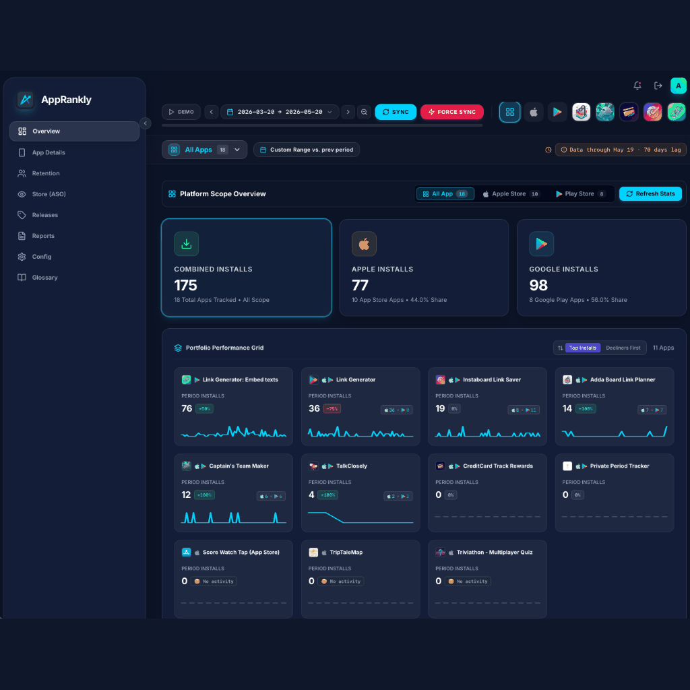
</p>

<details>
<summary><b>📷 Click to view individual full-resolution screenshots</b></summary>
<br />


### Unified Analytics Dashboard
Installs, uninstalls, active devices, and country breakdowns across Google Play & Apple App Store in one glassmorphic interface.

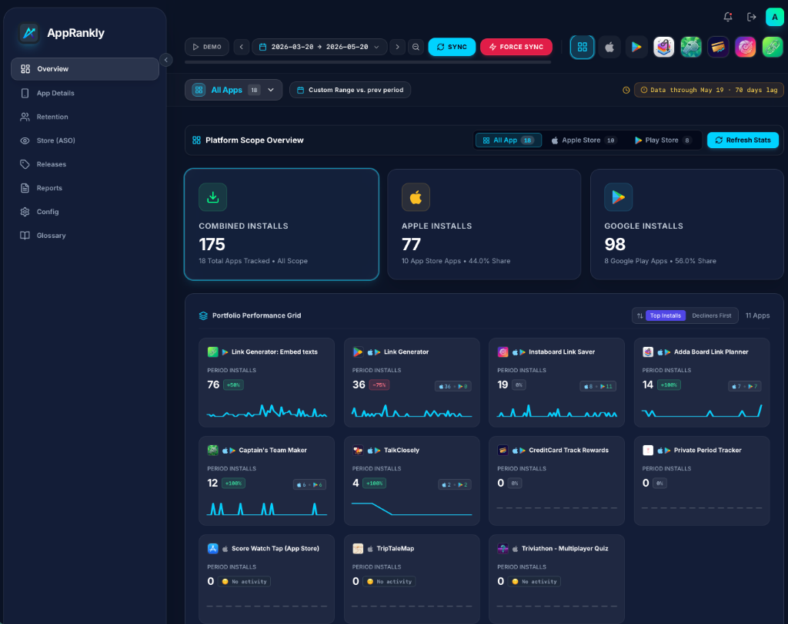

### Detailed App Metrics
Per-app drill-down: version performance, daily trends, retention, and country-level distribution.

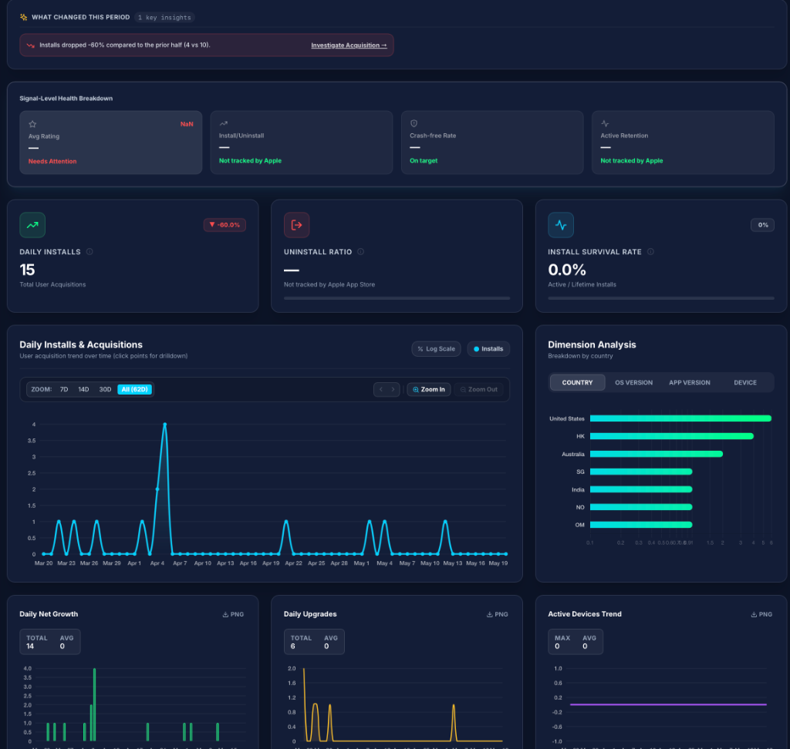

### Retention & User Survival Analytics
Cohort retention heatmaps, active retention proxies, survival curves, stickiness index, and churn risk intelligence.

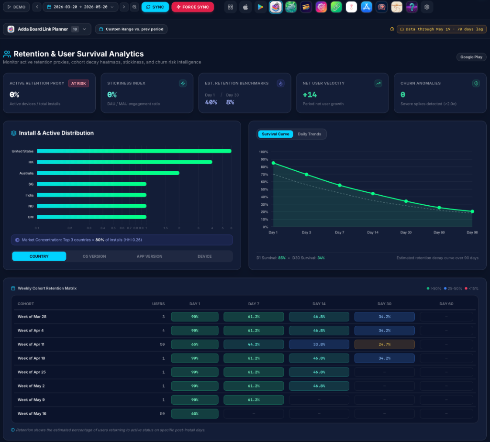

### AI-Powered ASO Studio
Mine store autocomplete for zero-cost keyword discovery, check keyword ranks, audit listing health, and generate metadata variants with your choice of AI provider (OpenAI, Anthropic, or Gemini).

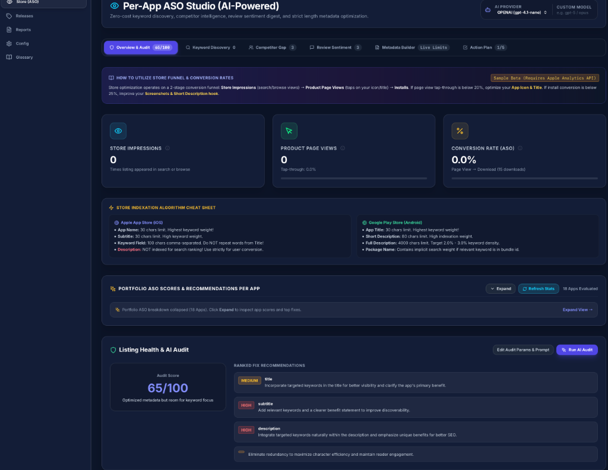

### Reports & Data Exports
Export overview stats, daily trends, dimension breakdowns, or full raw data archive bundles for offline analysis.

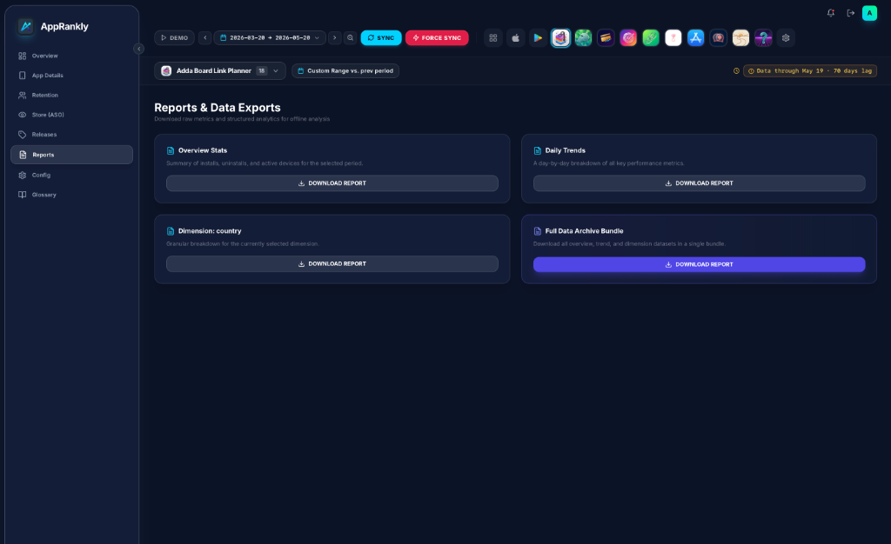

### Configuration Editor
Form editor, raw JSON manager, test connection tools, and built-in setup guide for credentials and data sources.

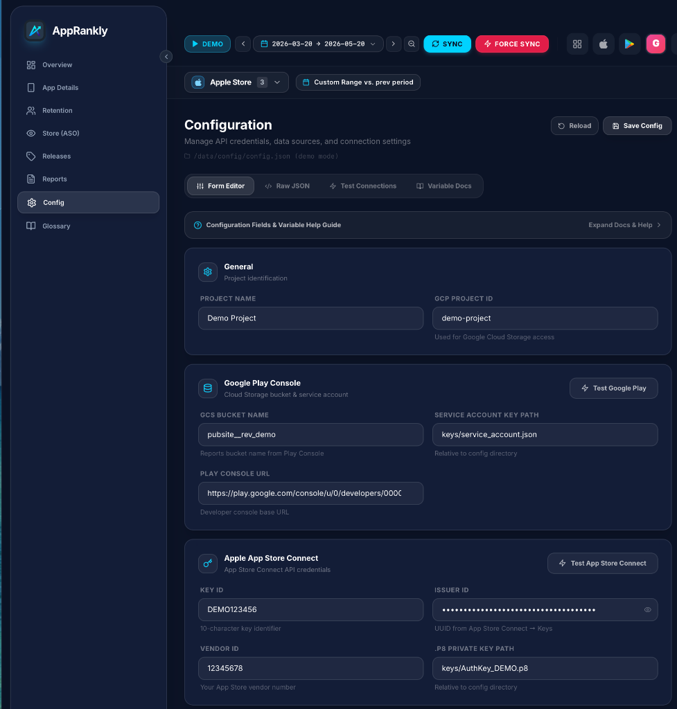

### Metrics Glossary & Formulas
Authoritative mathematical formulas, interpretation guides, platform origins, and data lag disclosures I have used to draw out metrics. 

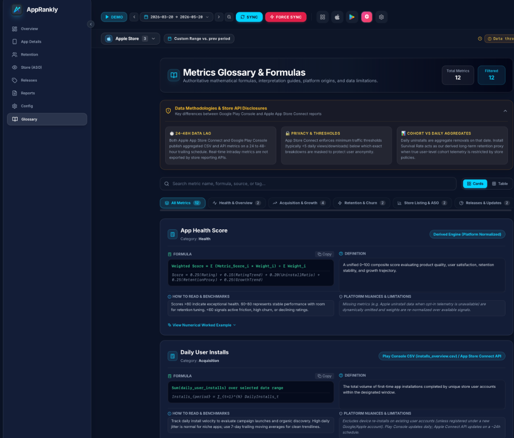

### App Notes & AI Insights
Persistent per-app notes with AI-generated summaries of reviews and sentiment trends.

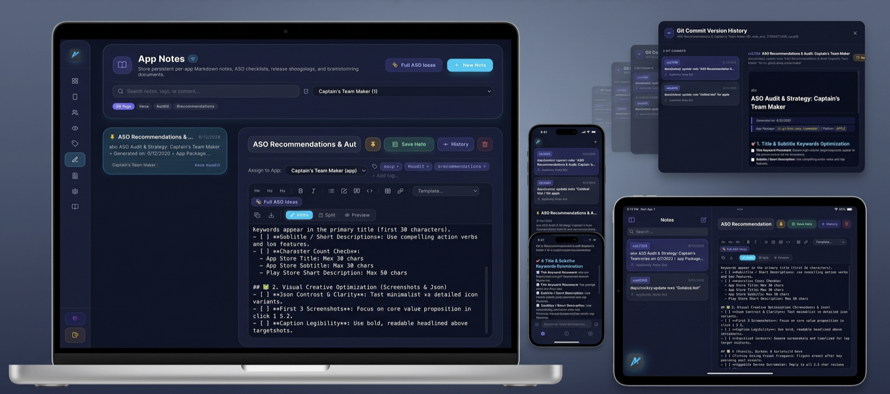

</details>

---

## Quick Start

Pick a deployment method. **Note where `config.json` lives for each** — it differs:

| Method | Put `config.json` in | Dashboard URL |
|---|---|---|
| Docker Compose | `./config/` | `http://localhost:3000` |
| Pre-built image (`docker run`) | `./data/config/` | `http://localhost:3000` |
| Unraid | `/mnt/user/appdata/AppRankly/config/` | `http://[SERVER-IP]:3020` |
| Docker Compose (Build from source) | `./config/` | `http://localhost:3000` |
| Local Node.js | `./data/config/` | `http://localhost:3000` |

> [!NOTE]
> **Why are API keys needed?** AppRankly fetches stats directly from official store APIs (Google Cloud Storage reports and Apple App Store Connect API) so your analytics remain 100% self-hosted and private. Before launching any deployment option below, obtain your API keys using the setup guides:
> - **Google Play**: [Google Play Credentials Setup](#1-google-play-via-gcs-reports) (Service Account `.json` key)
> - **Apple App Store**: [Apple Credentials Setup](#2-apple-app-store-connect-via-api) (`.p8` API key, Issuer ID & Key ID)

### Option 1: Docker Compose (recommended)

```bash
# 1. Clone
git clone https://github.com/zmsp/AppRankly.git
cd AppRankly

# 2. Create config (compose mounts ./config into the container)
mkdir -p config/keys
cp example.config.json config/config.json
# Edit config/config.json, drop API key files (.json for Google, .p8 for Apple) into config/keys/

# 3. Launch
docker compose up -d
```

Open **http://localhost:3000**.

### Option 2: Pre-built Docker image

```bash
# 1. Pull from GitHub Container Registry
docker pull ghcr.io/zmsp/apprankly:latest

# 2. Create config under ./data (this method mounts the whole data dir)
mkdir -p data/config/keys
cp example.config.json data/config/config.json
# Edit data/config/config.json and add key files to data/config/keys/

# 3. Run
docker run -d \
  --name AppRankly \
  -p 3000:3000 \
  -v $(pwd)/data:/app/data \
  -e JWT_SECRET="your-secure-random-secret" \
  ghcr.io/zmsp/apprankly:latest
```

### Option 3: Unraid

AppRankly is listed on [Unraid Community Applications](https://ca.unraid.net/apps/apprankly-1bdjnw60t14ouy).

1. Search **AppRankly** in the Unraid **Apps** tab and install.
2. Or add the template manually:
   ```bash
   curl -o /boot/config/plugins/dockerMan/templates-user/apprankly.xml https://raw.githubusercontent.com/zmsp/AppRankly/main/unraid/apprankly.xml
   ```
3. Fix path permissions: `chown -R 1000:1000 /mnt/user/appdata/AppRankly/`
4. Open `http://[YOUR-SERVER-IP]:3020`.

Full guide: [unraid/README.md](unraid/README.md).

### Option 4: Docker Compose (build from source)

Build and run the container locally from source code:

```bash
# 1. Clone
git clone https://github.com/zmsp/AppRankly.git
cd AppRankly

# 2. Create config
mkdir -p config/keys
cp example.config.json config/config.json
# Edit config/config.json, drop API key files into config/keys/

# 3. Launch with local build
docker compose -f docker-compose.build.yml up -d --build
```

Open **http://localhost:3000**.

### Option 5: Local Node.js development

Requires Node 20+ (**22.5+ recommended** — the SQLite cache layer uses the built-in `node:sqlite` and disables itself on older versions).

```bash
git clone https://github.com/zmsp/AppRankly.git
cd AppRankly

# Config (local dev reads ./data/config/config.json)
mkdir -p data/config/keys
cp example.config.json data/config/config.json

# Install server + frontend deps, then start (Express + Vite watch)
cd app && npm install
npm run download-model # Fetches the local AI model (112MB)
npm --prefix frontend install
npm run dev
```

---

## Key Features

- **App-specific notes & AI insights** — keep track of changes with persistent notes for each app; generate AI summaries of recent user reviews and sentiment trends to inform your strategy.
- **Unified cross-platform metrics** — installs, uninstalls, active devices, upgrades, and country/device/version breakdowns for Google Play and Apple App Store in one UI.
- **AI-powered ASO studio** — autocomplete keyword mining, keyword rank checks, competitor comparison, listing health audits, metadata variant generation, and review digests. Bring your own key: **OpenAI, Anthropic, or Gemini** (pick per provider in config).
- **SQLite caching layer** — daily facts and AI results are cached locally (`node:sqlite`, zero native deps), so repeat queries never re-download or re-bill.
- **Background scheduler + push alerts** — auto-syncs on an interval and sends install/uninstall alerts to your phone via [ntfy.sh](https://ntfy.sh/) (free, optional).
- **Release tracking** — log releases (or auto-detect them) and see them as markers on every trend chart.
- **Grafana-style date ranges** — quick presets (7/30/90 days, 1 year) plus custom ranges and single-day drill-downs.
- **Headless CLI** — pull metrics, backfill the database, or wire into cron jobs and notification bots.
- **Private by design** — JWT-authenticated, self-hosted; store keys and analytics never leave your server.
- **Container-ready** — multi-stage `node:22-alpine` image, non-root user, Unraid template included.

---

## Authentication & Credentials Setup

### 1. Google Play (via GCS reports)

Google Play exports daily CSV reports into a private Google Cloud Storage bucket. AppRankly reads them with a service account.

1. **Create a GCP service account key**
   - [Google Cloud IAM Console](https://console.cloud.google.com/iam-admin/serviceaccounts) → create service account (e.g. `playstore-stats-reader`).
   - **Keys** → **Add Key** → **Create New Key (JSON)** → save as `config/keys/google_key.json` (or `data/config/keys/` — see the table above).
2. **Grant access in Play Console**
   - [Play Console](https://play.google.com/apps/publish) → **Users and Permissions** → invite the service account email.
   - Grant **"View app information and download bulk reports (read-only)"**.
   - *Bucket permissions can take up to 24h to propagate.*
3. **Find your bucket name**
   - Play Console → **Download reports** → **Statistics** → **Copy Cloud Storage URI** (e.g. `gs://pubsite_prod_12345678/stats/installs/`).
   - The bucket name is the part between `gs://` and the first slash.

### 2. Apple App Store Connect (via API)

1. [App Store Connect](https://appstoreconnect.apple.com/) → **Users and Access** → **Integrations (Keys)** → **Generate API Key** with **Sales and Reports** role.
2. Download the `.p8` key into your `keys/` folder.
3. Note the **Issuer ID** (top of the Keys page) and the 10-character **Key ID**.

### 3. Push notifications (optional, via ntfy.sh)

1. Set `"ntfyTopic"` in `config.json` to a unique secret string (empty `""` = alerts off).
2. Install the free [ntfy app](https://ntfy.sh/) and subscribe to that topic — you'll get a push whenever a sync finds new installs/uninstalls, within your configured active hours.

---

## Configuration Reference

Copy `example.config.json` to your config location (see Quick Start table) and fill in your values:

```json
{
  "name": "Production Apps",
  "projectID": "your-gcp-project-id",
  "bucketName": "pubsite_prod_12345678",
  "keyFilePath": "keys/google_key.json",
  "appleIssuerId": "xxxx-xxxx-xxxx-xxxx",
  "appleKeyId": "XXXXXXXXXX",
  "appleVendorId": "85000000",
  "keyFilePath_apple": "keys/apple_key.p8",
  "PlaystoreConsoleUrl": "https://play.google.com/console/u/0/developers/123456",
  "ntfyTopic": "",
  "refreshIntervalHours": 1,
  "statsCheckRangeDays": 30,
  "activeStartHour": 9,
  "activeEndHour": 20,
  "appMetadata": {
    "com.example.app": { "consoleAppId": "123456" }
  },
  "ignoredPackages": ["com.example.testapp"],
  "ai": {
    "defaultProvider": "openai",
    "providers": {
      "openai":    { "apiKey": "sk-...", "model": "gpt-4.1-nano" },
      "anthropic": { "apiKey": "sk-ant-...", "model": "claude-opus-4-8" },
      "gemini":    { "apiKey": "...", "model": "gemini-3.6-flash" }
    }
  }
}
```

### Configuration fields

| Field | Platform | Description | Required |
|-------|----------|-------------|----------|
| `name` | Both | Display label for this account | Yes |
| `projectID` | Google | Google Cloud project ID | For Google Play |
| `bucketName` | Google | GCS bucket from Play Console URI | For Google Play |
| `keyFilePath` | Google | Service-account JSON key path, relative to `config.json` | For Google Play |
| `appleIssuerId` | Apple | App Store Connect Issuer ID | For Apple |
| `appleKeyId` | Apple | App Store Connect Key ID | For Apple |
| `keyFilePath_apple` | Apple | `.p8` key path, relative to `config.json` | For Apple |
| `appleVendorId` | Apple | 8-digit vendor number (Payments & Financial Reports) | Optional |
| `PlaystoreConsoleUrl` | Google | Console base URL for deep links | Optional |
| `ntfyTopic` | Alerts | ntfy.sh topic; `""` disables push alerts | Optional |
| `refreshIntervalHours` | Scheduler | Auto-sync frequency (default `1`) | Optional |
| `statsCheckRangeDays` | Scheduler | Sync lookback window in days (default `30`) | Optional |
| `activeStartHour` / `activeEndHour` | Scheduler | Notification window, local hours 0–23 (default `9`–`20`) | Optional |
| `appMetadata` | Google | Per-package extras (e.g. `consoleAppId` for deep links) | Optional |
| `ignoredPackages` | Both | Package/bundle IDs to hide from the dashboard | Optional |
| `ai` | ASO | AI provider keys + models; only providers with a key show up in the UI | Optional |

> **AI models**: any current model ID works — the string passes straight through to the provider. Cheaper tiers (e.g. `gpt-4.1-nano`, `claude-haiku-4-5`, Gemini Flash) are plenty for ASO tasks; verify current names on your provider's model page.

### Environment variables

| Variable | Default | Description |
|----------|---------|-------------|
| `PORT` | `3000` | HTTP port |
| `JWT_SECRET` | auto-generated & persisted | Auth token secret — set explicitly in production |
| `CONFIG_PATH` | `<DATA_DIR>/config/config.json` | Config file location |
| `DATA_DIR` | `/app/data` (Docker) · `./data` (local dev) | Persistent storage: SQLite DB, CSV cache, auth state |
| `NTFY_TOPIC` | `""` | Fallback ntfy topic (config value wins) |

---

## Headless CLI Utility

```bash
# Sync + report for the first configured project
node app/cli.js -s 0

# By project name
node app/cli.js -s "Production Apps"

# Explicit parameters (no config file)
node app/cli.js \
  --key="data/config/keys/google_key.json" \
  --projectID="your-gcp-project-id" \
  --bucketName="pubsite_prod_12345678" \
  --packageName="com.example.app"
```

Database maintenance (run from `app/`):

```bash
npm run db:migrate    # apply schema migrations
npm run db:backfill   # ingest all downloaded reports (cli.js backfill --since YYYY-MM)
npm run db:status     # per-app coverage & row counts
npm run cache:clear   # drop cached aggregates
```

| Argument | Short | Description |
|----------|-------|-------------|
| `--project` | `-s` | Name or zero-based index of a project in `config.json` |
| `--config` | `-c` | Path to `config.json` |
| `--key` | `-k` | Google service-account JSON key path |
| `--projectID` | `-g` | Google Cloud project ID |
| `--bucketName` | `-b` | Play Console GCS bucket |
| `--packageName` | `-p` | Target a single app package |

---

## Architecture & Tech Stack

- **Backend**: Node.js 20+ / Express, JWT auth, `node:sqlite` cache (22.5+), Fast-CSV (UTF-16 Play reports), Google Cloud Storage SDK, ES256-signed App Store Connect client, background scheduler + ntfy notifier.
- **Frontend**: React 18 + Vite, Tailwind CSS (glassmorphic dark theme), Chart.js via react-chartjs-2, React Router.
- **ASO / AI**: `google-play-scraper` + iTunes Search API for listings, ranks, and reviews; provider-agnostic AI adapter for OpenAI / Anthropic (`@anthropic-ai/sdk`) / Gemini (`@google/genai`).
- **Packaging**: multi-stage `node:22-alpine` Docker image (non-root), Unraid XML template, static demo build published to GitHub Pages.

### System architecture

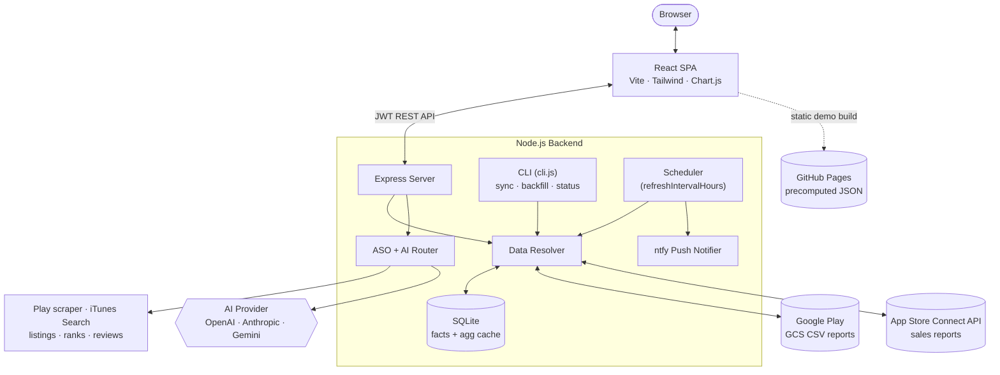

### Data lookup waterfall

Every stats request resolves through a fixed cache hierarchy — the network is the last resort, and lower tiers backfill the faster ones:

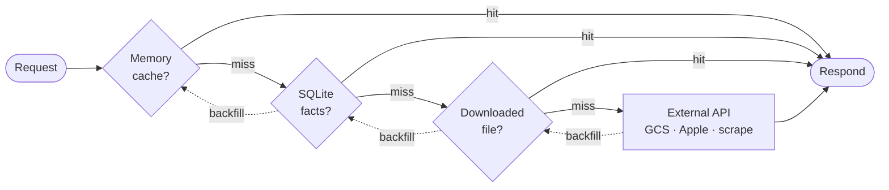

---

## Troubleshooting & FAQ

<details>
<summary><b>Google Play shows 0 stats or permission-denied errors</b></summary>
GCS bucket permissions can take up to 24 hours to propagate after inviting the service account in Play Console. Confirm the account has <i>"View app information and download bulk reports (read-only)"</i>.
</details>

<details>
<summary><b>Permission errors on Unraid / Docker volumes</b></summary>
The container runs as non-root UID 1000 (<code>node</code>). Make the host data folder writable:
<code>chown -R 1000:1000 /path/to/data</code>
</details>

<details>
<summary><b>Log says "node:sqlite module not available"</b></summary>
The SQLite cache layer needs Node ≥ 22.5 and disables itself gracefully on older versions (everything still works, just without local caching). The official Docker image ships Node 22, so this only affects bare-metal installs.
</details>

<details>
<summary><b>Can I evaluate it without any credentials?</b></summary>
Yes — use the <a href="https://zmsp.github.io/AppRankly/#demo">hosted live demo</a>, or toggle <b>Demo Mode</b> in the sidebar of your own instance to explore with simulated data.
</details>

---

## Contributing

Contributions are welcome! Please see [CONTRIBUTING.md](CONTRIBUTING.md) for step-by-step instructions on setting up your local development environment, submitting feature requests, and opening pull requests.

For security concerns and vulnerability reporting, please review our [Security Policy](SECURITY.md).

---

## Support & My Apps

Explore more self-hosted tools at **[apps.shahadat.us](https://apps.shahadat.us/)** or support development:

[](https://apps.shahadat.us/)
[](https://buymeacoffee.com/zprimecreates)

---

## License

Open-source under the **[GNU Affero General Public License v3.0 (AGPL-3.0)](LICENSE)**.
